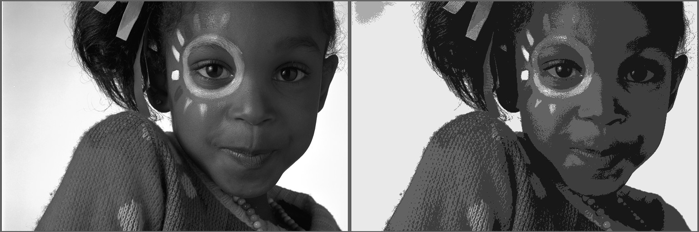

# Image Clusterer

## Quick start:

compile using `make` (requires sfml) run using `./clusterer image.png`, use arrow up/down to change the number of bins and arrow left/right to change gamma.

## How it works

This program implements an "optimal" binning algorithm for color-space reduction. This can be useful for stencil creation as well as laser-cutter engravings or any other kind of project where a reduced set of colors is required

## Example result

